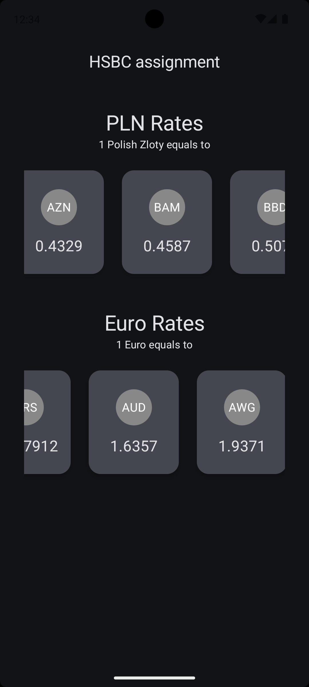
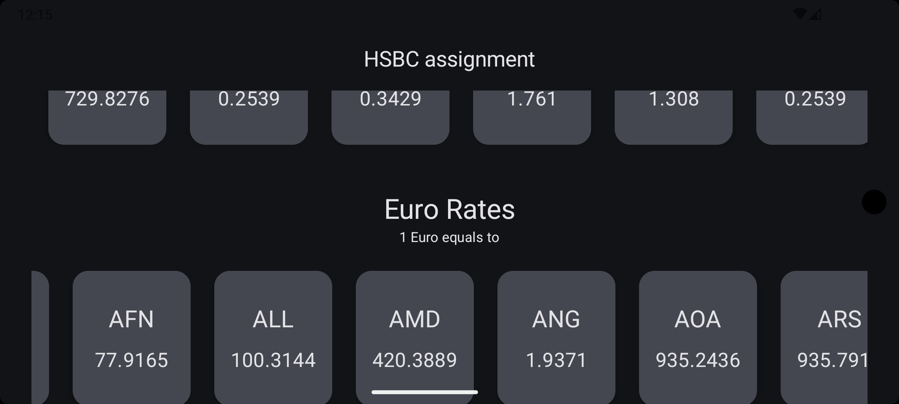

# My Assignment

## Introduction

This project is a simple Android application that displays the currency rates for PLN, and EURO,
which is being refreshed every
minute. The API used for fetching the currency rates is: https://www.exchangerate-api.com/

## Tech Stack

- Kotlin
- Kotlin Serialization (ready to be migrated to KMP)
- Kotlin Coroutines
- MVVM Architecture
- 100% Jetpack Compose
- Hilt
- Retrofit

I've also used one of my
libraries, [Reusable Components for Jetpack Compose](https://github.com/LinX64/Reusable) to make the
development faster.

**Note**: To make the development faster and get rid of the Kotlin Serialization limits for objects,
I've used a custom Deserializer for the API response. 

## Screenshots

## Features

- Auto retry on network failure
- Scrollable content - compatible with any screen size
- Edge-to-edge
- Dark mode
- Error handling
- Loading state with Progress Bar
- Unit tests (just a couple of them to showcase the testing approach)
- Instrumented tests
